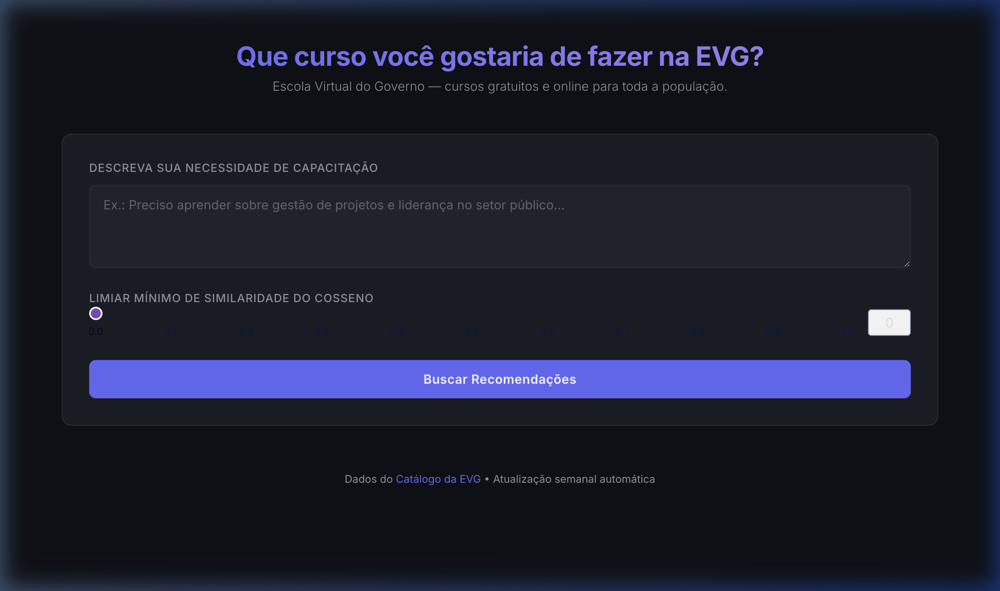
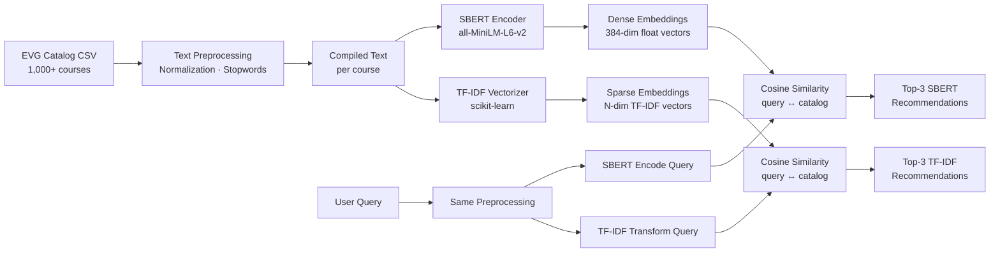

<div align="center">

# EVG Course Recommender

### *Que curso você gostaria de fazer na EVG?*

A **dual-model NLP recommender system** that suggests free online courses from Brazil's
[Escola Virtual de Governo](https://www.escolavirtual.gov.br/) based on a natural-language
description of the user's training needs.

Built with **Sentence-BERT**, **TF-IDF**, **Cosine Similarity**, and **Dash**.


</div>

---

<p align="center">
  
  &nbsp;
  
</p>

---

## Table of Contents

- [Overview](#overview)
- [NLP Pipeline & Architecture](#nlp-pipeline--architecture)
  - [Text Preprocessing](#1-text-preprocessing)
  - [Embedding Generation](#2-embedding-generation)
  - [SBERT vs TF-IDF — A Technical Comparison](#3-sbert-vs-tf-idf--a-technical-comparison)
  - [Cosine Similarity & Ranking](#4-cosine-similarity--ranking)
- [Tech Stack](#tech-stack)
- [Project Structure](#project-structure)
- [Getting Started](#getting-started)
- [How to Use](#how-to-use)
- [Automation — GitHub Actions](#automation--github-actions)
- [Docker](#docker)
- [License](#license)

---

## Overview

The EVG (Escola Virtual do Governo) offers **1,000+ free courses** to Brazilian citizens, covering public policy, leadership, data science, law, health, and more. Finding the right course from that catalog is not trivial.

This application addresses that problem with a **content-based recommender system** powered by two distinct NLP embedding strategies. The user describes — in plain Portuguese — what skill or knowledge they need, and the system returns the **top 3 most semantically relevant courses** from each model, ranked by **cosine similarity**.

**Key differentiator**: by running **SBERT and TF-IDF side by side**, the application lets the user compare a *deep semantic* understanding of language (SBERT) against a *statistical lexical* approach (TF-IDF) — exposing the strengths and trade-offs of each method in a real-world recommendation scenario.

---

## NLP Pipeline & Architecture



### 1. Text Preprocessing

Before any vectorisation, the raw course text goes through a cleaning pipeline designed specifically for Portuguese:

| Step | Technique | Purpose |
|------|-----------|---------|
| **Accent Removal** | Character-level translation table (ã→a, ç→c, …) | Normalize orthographic variation |
| **Lowercasing** | `str.lower()` | Case-insensitive matching |
| **Stopword Removal** | NLTK Portuguese corpus | Remove function words (*de, para, que, com, …*) that carry no semantic weight |
| **Punctuation Stripping** | Regex substitution | Remove noise characters |
| **Text Compilation** | Column concatenation | Merge `nome_curso`, `eixos_tematicos`, `competencias`, `apresentacao`, and `conteudo_programatico` into a single text blob |

The result is a `compilado_textual` column — one clean, semantically dense string per course — which feeds both embedding pipelines.

### 2. Embedding Generation

#### SBERT (Sentence-BERT)

[Sentence-BERT](https://www.sbert.net/) is a modification of the BERT transformer architecture fine-tuned to produce **semantically meaningful sentence embeddings**. Unlike vanilla BERT (which outputs token-level representations), SBERT uses a **siamese/triplet network structure** with mean pooling to produce a single **fixed-length dense vector** per input sentence.

**Model used**: [`all-MiniLM-L6-v2`](https://huggingface.co/sentence-transformers/all-MiniLM-L6-v2)

- **Architecture**: 6-layer MiniLM transformer (distilled from a larger model)
- **Output dimension**: **384 floats** per sentence
- **Training**: Contrastive learning on 1B+ sentence pairs — the model learned to place semantically *similar* sentences close together in vector space and *dissimilar* ones far apart
- **Key property**: Captures **semantic meaning** — synonyms, paraphrases, and conceptual similarity are reflected in the vector geometry, even when the texts share few or no words

```python
# Core embedding logic (simplified)
model = SentenceTransformer("all-MiniLM-L6-v2")
embeddings = model.encode(texts, normalize_embeddings=True)
# Result: tensor of shape (1004, 384)
```

**Normalization** (`normalize_embeddings=True`) ensures each vector has unit L2 norm. This is critical because cosine similarity between unit vectors reduces to a simple **dot product**, making retrieval both faster and numerically stable.

#### TF-IDF (Term Frequency – Inverse Document Frequency)

TF-IDF is a classical **statistical NLP technique** that represents a document as a **sparse high-dimensional vector** where each dimension corresponds to a term (word) in the vocabulary.

Each weight is the product of two factors:

$$\text{TF-IDF}(t, d) = \underbrace{\text{TF}(t, d)}_{\text{How often } t \text{ appears in } d} \times \underbrace{\log\!\left(\frac{N}{\text{DF}(t)}\right)}_{\text{How rare } t \text{ is across all docs}}$$

- **TF (Term Frequency)**: Counts how often a term appears in a given document. More occurrences → higher weight.
- **IDF (Inverse Document Frequency)**: Down-weights terms that appear in many documents (common words like *curso*, *módulo*) and up-weights terms that are rare and therefore more discriminating.

```python
# Core embedding logic (simplified)
vectorizer = TfidfVectorizer()
tfidf_matrix = vectorizer.fit_transform(texts)
# Result: sparse matrix of shape (1004, 8756)
```

Each course becomes an **8,756-dimensional sparse vector** (one dimension per unique term in the vocabulary). Most values are zero — only the terms that actually appear in a given course have non-zero weights.

### 3. SBERT vs TF-IDF — A Technical Comparison

| Aspect | SBERT | TF-IDF |
|--------|-------|--------|
| **Representation** | Dense vector (384 floats) | Sparse vector (~8,756 dims, mostly zeros) |
| **What it captures** | **Semantic meaning** — understands synonyms, paraphrases, intent | **Lexical overlap** — matches exact words and related terms |
| **Example insight** | "liderança no setor público" → recommends courses about *leadership development*, *municipal governance* | "liderança no setor público" → recommends courses with the words *liderança* and *setor público* in their description |
| **How it works** | Transformer neural network with attention mechanism; trained on 1B+ sentence pairs | Statistical word counting with frequency-based weighting |
| **Vocabulary handling** | Subword tokenisation (WordPiece) — handles unseen words | Exact word matching — unseen words get zero weight |
| **Training required** | Pre-trained on massive corpora; no task-specific training needed | No training — fully unsupervised, computed directly from the corpus |
| **Speed** | Slower at encoding (neural forward pass) | Very fast (sparse matrix operations) |
| **When it shines** | User describes a *concept* without using the exact course terminology | User uses *keywords* that appear directly in the course catalog |

**Why use both?** Neither model is universally superior. SBERT excels when the user's description is conceptually related to a course but uses different words. TF-IDF excels when exact terminology matters. Showing both results side by side gives the user a richer and more reliable set of recommendations.

### 4. Cosine Similarity & Ranking

Both models use **cosine similarity** as the sole ranking metric. Given a query vector $\vec{q}$ and a document vector $\vec{d}$:

$$\text{cosine\_sim}(\vec{q}, \vec{d}) = \frac{\vec{q} \cdot \vec{d}}{\|\vec{q}\| \cdot \|\vec{d}\|}$$

- **Range**: $[-1, 1]$ (in practice $[0, 1]$ for TF-IDF since weights are non-negative)
- **1.0** = identical direction (perfect match)
- **0.0** = orthogonal (no relationship)

The user can adjust a **threshold slider** (0.0 to 1.0, step 0.1) to filter out low-confidence recommendations. Only courses whose cosine similarity score meets or exceeds the threshold are displayed.

---

## Tech Stack

| Component | Technology |
|-----------|------------|
| **Frontend** | [Dash](https://dash.plotly.com/) (Python) |
| **SBERT Embeddings** | [sentence-transformers](https://www.sbert.net/) + [PyTorch](https://pytorch.org/) |
| **TF-IDF Embeddings** | [scikit-learn](https://scikit-learn.org/) `TfidfVectorizer` |
| **Similarity** | Cosine Similarity (`torch` / `sklearn.metrics.pairwise`) |
| **NLP Preprocessing** | [NLTK](https://www.nltk.org/) (Portuguese stopwords) |
| **Data Source** | [EVG Official Catalog CSV](https://www.escolavirtual.gov.br/catalogo/exportar/csv) |
| **Automation** | GitHub Actions (weekly cron) |
| **Containerisation** | Docker + Docker Compose |

---

## Project Structure

```
recomender/
│
├── app.py                          # 🚀 Dash entrypoint (frontend)
├── assets/
│   └── style.css                   # Dark-mode minimalist theme
│
├── recommenders/                   # OOP recommender classes
│   ├── base.py                     # Abstract base class (ABC)
│   ├── sbert_recommender.py        # SBERT — cosine similarity only
│   └── tfidf_recommender.py        # TF-IDF — cosine similarity only
│
├── utils/                          # Shared utilities
│   ├── data_loader.py              # CSV download & DataFrame preparation
│   └── preprocessing.py            # Text cleaning & compilation
│
├── scripts/
│   └── build_embeddings.py         # CLI: download catalog + rebuild embeddings
│
├── data/
│   └── catalogo_evg.csv            # Course catalog (~1,000 courses)
│
├── embeddings/
│   ├── sbert_embeddings.pt         # Cached SBERT tensor (1004 × 384)
│   └── tfidf_artifacts.pkl         # Cached TF-IDF vectorizer + matrix
│
├── .github/workflows/
│   └── update_catalog.yml          # Weekly auto-update
│
├── Dockerfile
├── docker-compose.yml
├── requirements.txt
├── setup_venv.sh
└── .gitignore
```

---

## Getting Started

### Prerequisites

- **Python 3.11+**
- **pip** (or Docker)

### Option A — Local Setup

```bash
# 1. Clone the repository
git clone https://github.com/<your-username>/recomender.git
cd recomender

# 2. Create virtual environment & install dependencies
bash setup_venv.sh
source .venv/bin/activate

# 3. Download the catalog and generate embeddings (first time only)
python scripts/build_embeddings.py

# 4. Launch the application
python app.py
```

Open your browser at **http://localhost:8050**.

### Option B — Docker

```bash
docker compose up --build
```

The app will be live at **http://localhost:8050**.

---

## How to Use

1. **Describe your need** — Write in the text area what skill, topic, or knowledge you want to develop. Be as specific or broad as you like. Examples:
   - *"Quero aprender sobre ciência de dados e visualização de informações"*
   - *"Preciso de capacitação em gestão de projetos no setor público"*
   - *"Tenho interesse em direitos humanos e políticas de inclusão"*

2. **Adjust the threshold** — Use the slider to set the minimum cosine similarity score (0.0 = show everything, 1.0 = only perfect matches). A value around **0.2–0.3** is a good starting point.

3. **Click "Buscar Recomendações"** — The app processes your text through both models and returns:
   - **SBERT recomenda:** — The 3 courses most *semantically* similar to your description
   - **TF-IDF recomenda:** — The 3 courses most *lexically* similar to your description

4. **Compare the results** — Notice how SBERT can find relevant courses even when you don't use the exact terminology, while TF-IDF favors keyword matches. Use both to make a well-informed choice.

Each course card shows:
- **Course name**
- **Description** (truncated)
- **Cosine similarity score** — how well it matches your query
- **Course hours** — estimated workload

---

## Automation — GitHub Actions

The catalog and embeddings are **automatically refreshed every Monday at 06:00 UTC** via a GitHub Actions workflow:

1. Downloads the latest CSV from the EVG official endpoint
2. Runs `scripts/build_embeddings.py` to regenerate both SBERT and TF-IDF embeddings
3. Commits and pushes the updated `data/` and `embeddings/` directories

You can also trigger a manual update from the **Actions** tab → **"Atualizar Catálogo EVG e Regenerar Embeddings"** → **"Run workflow"**.

---

## Docker

```bash
# Build and run
docker compose up --build

# Run in detached mode
docker compose up -d

# Stop
docker compose down
```

The container exposes port **8050** and mounts `data/` and `embeddings/` as volumes for persistence.

---

<div align="center">

**Dados do [Catálogo da Escola Virtual do Governo](https://www.escolavirtual.gov.br/catalogo)**

</div>
